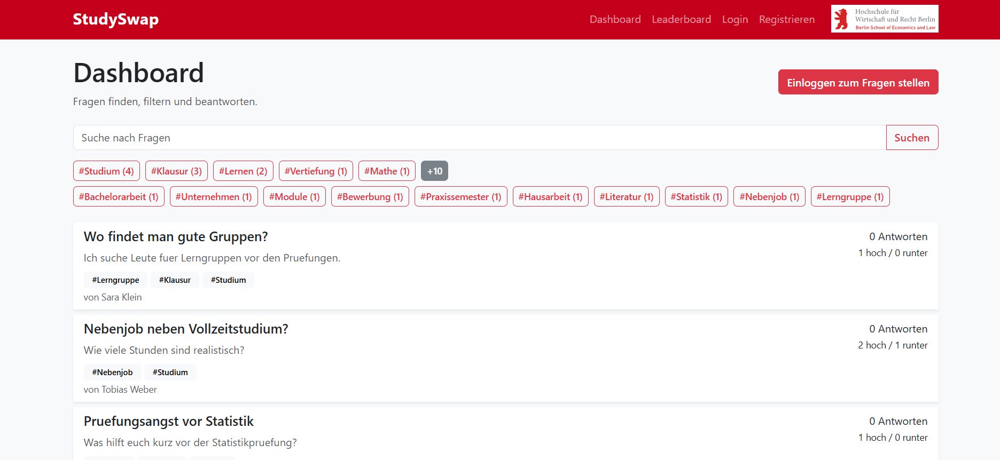
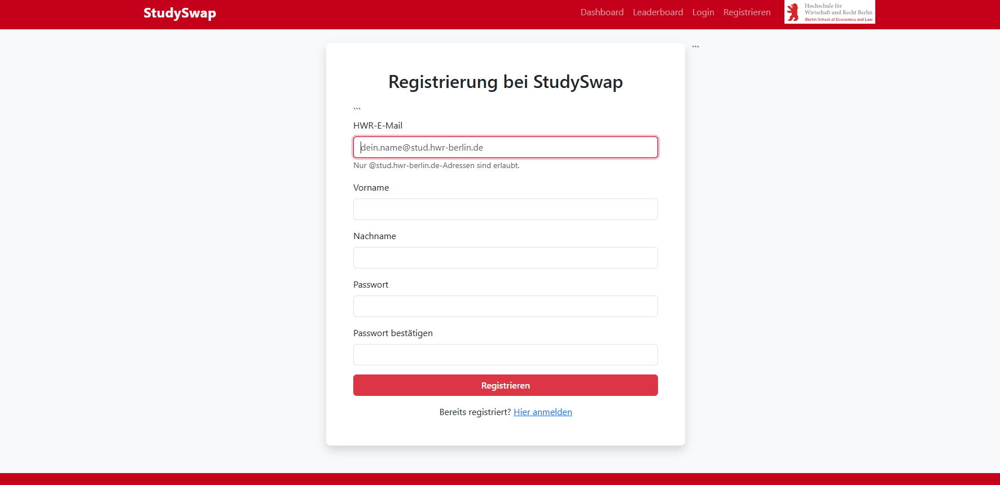
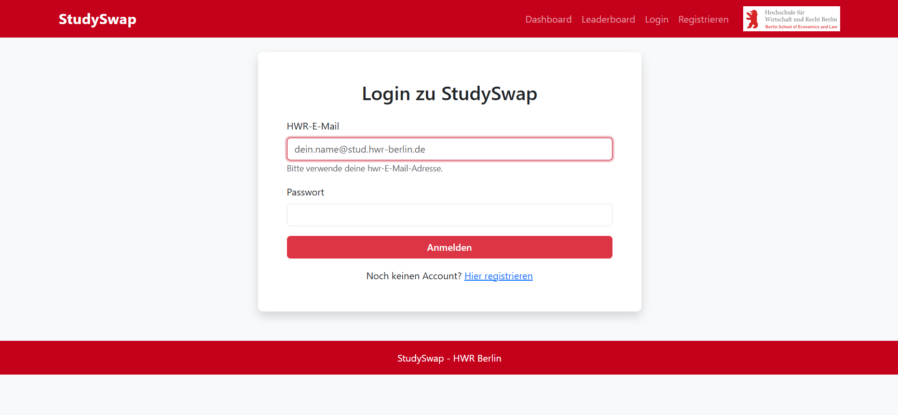
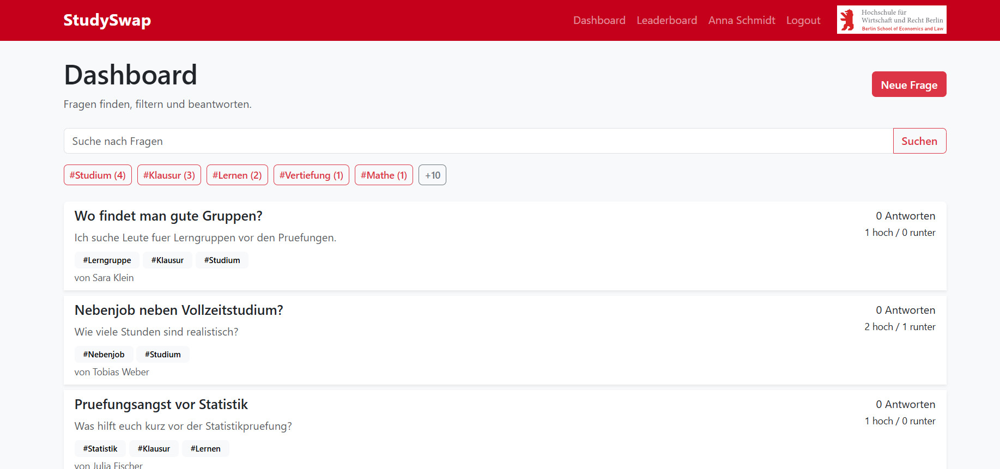
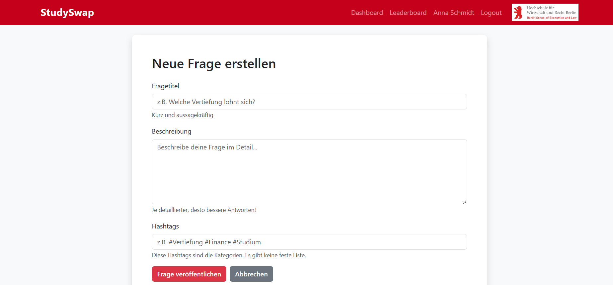
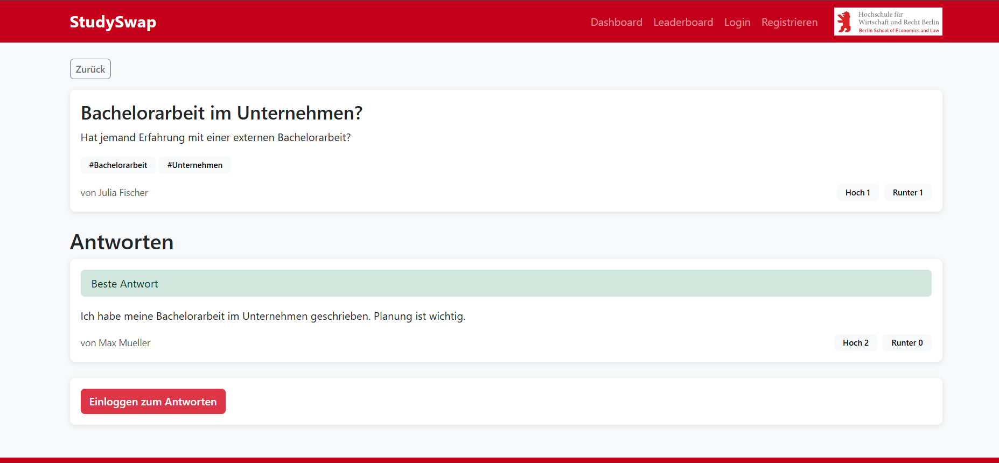
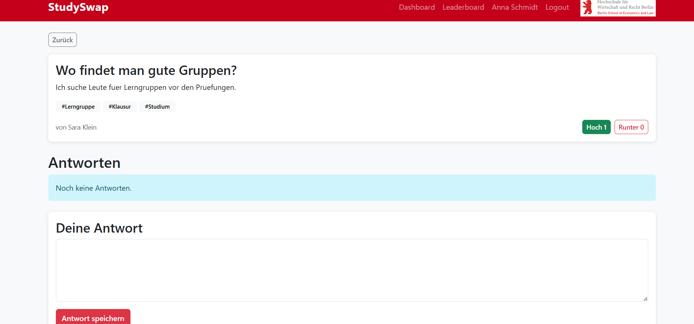
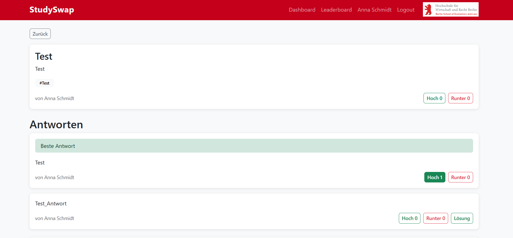
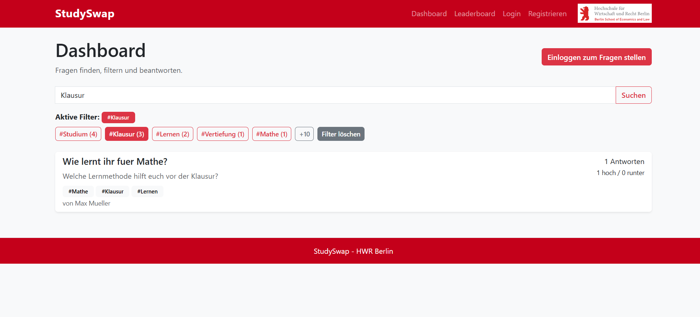
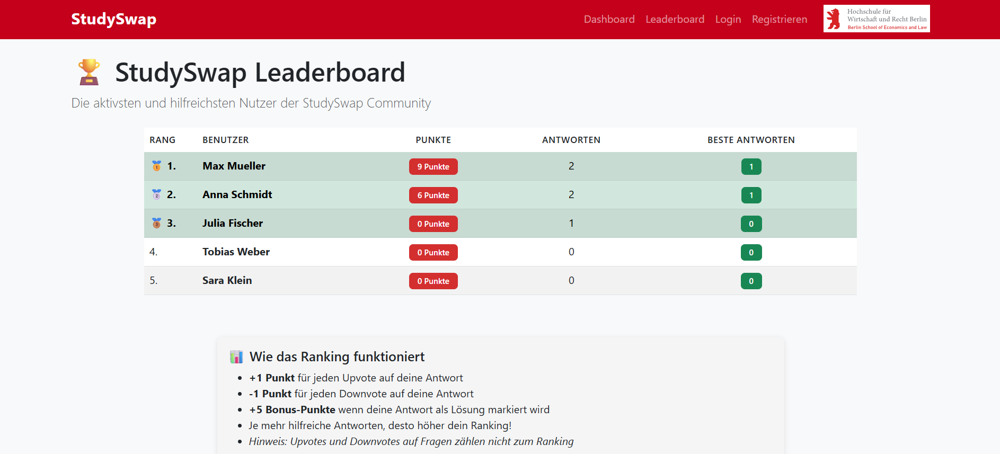

# Team: Webpioniere

# Contents of this repository

# StudySwap – Team Webpioniere

StudySwap ist eine Flask-Webanwendung für Studierende der HWR Berlin. Studierende können Fragen mit Hashtags veröffentlichen, Antworten verfassen und bewerten sowie hilfreiche Antworten als Lösung markieren. Das Leaderboard macht hilfreiche User sichtbar.

## Happy Path lokal starten

## Windows (PowerShell)

```powershell
cd fswd-app-webpioniere
py -m venv .venv
.\.venv\Scripts\python.exe -m pip install -r requirements.txt
.\.venv\Scripts\python.exe -m flask --app app init-db
.\.venv\Scripts\python.exe -m flask --app app run
```

## macOS / Linux

```bash
cd fswd-app-webpioniere
python3 -m venv .venv
./.venv/bin/python -m pip install -r requirements.txt
./.venv/bin/python -m flask --app app init-db
./.venv/bin/python -m flask --app app run
```

## Terminal innerhalb VSCode im Projekt

```bash
python -m venv venv / python3 -m venv venv
Fixes to errors python -m pip install -U virtualenv / python3 -m pip install -U virtualenv
Press Shift+Ctrl+P / Shift+⌘+P to open the command palette and start typing python select interpreter. Accept the command by pressing Enter and choose the Python interpreter from your project’s 📁venv/ folder. Usually, Visual Studio Code will highlight this with a star (☆).

Press Shift+Ctrl+P / Shift+⌘+P again, now start typing terminal create new terminal. Accept the command to launch a new terminal. Visual Studio Code should launch the Python Virtual Environment for you. If everything worked as intended, this will be indicated with (venv) at the beginning of the terminal line. - Hinweis: Englisch, weil aus fswd-home kopiert.
Install requirements in the opened terminal: pip install -r requirements.txt
Write flask init-db in the terminal
Write flask run in the terminal
```

Danach die App im Browser öffnen: <http://127.0.0.1:5000>.

> Hinweis: `init-db` setzt die lokale Datenbank zurück. Die URL "http://127.0.0.1:5000/insert/sample" lädt die Testnutzer, Fragen, Antworten und Bewertungen für den Happy Path.

### Happy Path ausprobieren

1. Auf dem **Dashboard** sind Fragen, Suche und Hashtag-Filter ohne Anmeldung sichtbar.
2. Mit einem Testkonto anmelden, zum Beispiel `anna@stud.hwr-berlin.de` mit dem Passwort `passwort`.
3. **Neue Frage** wählen, Titel, Beschreibung und mindestens einen Hashtag eingeben und veröffentlichen.
4. Die neue Frage im Dashboard öffnen, eine Antwort schreiben, die Frage bzw. Antwort bewerten und als Ersteller der Frage eine Antwort über **Lösung** als beste Antwort markieren.
5. Über **Leaderboard** die aktualisierte Rangliste öffnen; über Suche oder Hashtags kann das Dashboard gefiltert werden.

Weitere Testkonten (jeweils Passwort `passwort`):

```text
max@stud.hwr-berlin.de
julia@stud.hwr-berlin.de
tobias@stud.hwr-berlin.de
sara@stud.hwr-berlin.de
```

## Happy Path – Screenshots

Die folgenden Screenshots dokumentieren den Happy Path als visuelle Referenz.

### 1. Öffentliches Dashboard

Das Dashboard zeigt Fragen, deren Tags, Antwortanzahl und Bewertungen. Suche und Filter stehen auch nicht angemeldeten Besuchern zur Verfügung; zum Erstellen einer Frage ist ein Login nötig.



### 2. Registrierung

Neue Nutzer registrieren sich mit Vorname, Nachname, Passwort und einer `@stud.hwr-berlin.de`-Adresse. Nach erfolgreicher Registrierung wird der Nutzer automatisch angemeldet.



### 3. Login

Bereits vorhandene Nutzer können sich mit HWR-E-Mail-Adresse und Passwort anmelden. Für die schnelle Prüfung stehen die oben genannten Testkonten bereit.



### 4. Dashboard nach dem Login

Nach der Anmeldung erscheint der Button **Neue Frage**. In der Navigation werden der angemeldete Nutzer und die Logout-Option angezeigt.



### 5. Neue Frage erstellen

Das Formular verlangt einen Titel und eine Beschreibung. Hashtags werden frei eingegeben und dienen anschließend als filterbare Kategorien.



### 6. Detailansicht ohne Login

Eine einzelne Frage mit vorhandenen Antworten ist öffentlich sichtbar. Nicht angemeldete Besucher werden zum Login aufgefordert, wenn sie antworten möchten.



### 7. Detailansicht nach dem Login

Angemeldete Nutzer können Fragen und Antworten hoch- oder runtervoten sowie über das Antwortformular eine neue Antwort verfassen.



### 8. Beste Antwort als Lösung markieren

Der Ersteller einer Frage kann eine Antwort über den Button **Lösung** als beste Antwort markieren. Die markierte Antwort wird deutlich hervorgehoben.



### 9. Suche und Hashtag-Filter

Die Suche grenzt Fragen nach Text ein. Zusätzlich können Hashtags, hier `#Klausur`, als Filter ausgewählt und über **Filter löschen** zurückgesetzt werden.



### 10. Leaderboard

Das Leaderboard sortiert Nutzer nach Punkten aus Bewertungen ihrer Antworten und als Lösung markierten Antworten. Die Punkte-Regeln werden direkt auf der Seite erläutert.



## Technik

- Python, Flask und Jinja2
- SQLite
- Bootstrap für Styling und Komponenten
- JSON-API: `/api/questions`

