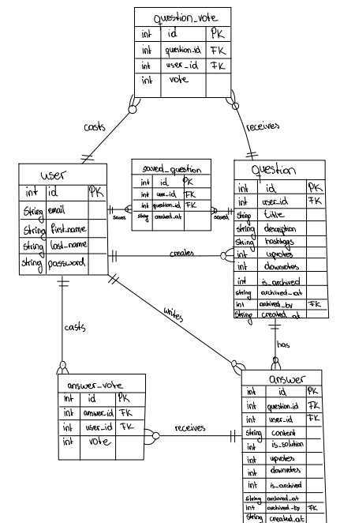

{: .no_toc }
# Data Model

Table of contents

+ ToC
{: toc }
{: .text-delta }

## Zweck und Prioritäten

Das Datenmodell bildet den Happy Path von **StudySwap** ab.
Die Modellierung folgt dabei diesen Prioritäten:

1. **Austausch ermöglichen:** `user`, `question` und `answer` speichern Accounts, Fragen und Antworten anderer Studierender.
2. **Hilfreiche Inhalte sichtbar machen:** `question_vote`, `answer_vote` sowie `answer.is_solution` bilden Bewertungen und die beste Antwort ab.
3. **Aktivität "belohnen":** Das Leaderboard berechnet Punkte aus positiven und negativen Stimmen auf Antworten sowie aus als Lösung markierten Antworten. Es benötigt keine eigene Tabelle.

Die Modellierung wurde um einfache Speichermöglichkeiten für Lieblingsfragen und um einen Archivierungsstatus für Fragen und Antworten erweitert.

## Visualisierung

*Abbildung: Entitäts-Beziehungs-Diagramm des implementierten SQLite-Datenmodells.*

## Tabellen und Felder

| Tabelle | Aufgabe | Wichtige Felder und Regeln |
| --- | --- | --- |
| `user` | Registrierte Studierende und Anmeldung | `id` ist der automatisch vergebene Primärschlüssel. `email` ist eindeutig und Pflicht; `first_name`, `last_name` und `password` sind ebenfalls Pflichtfelder. |
| `question` | Eine von einem Nutzer gestellte Frage | `user_id` verweist auf den Ersteller. `title`, `description` und `hashtags` sind Pflicht. `upvotes` und `downvotes` starten bei `0`; `created_at` erhält standardmäßig den aktuellen Zeitstempel. Zusätzlich gibt es `is_archived`, `archived_at` und `archived_by` für den Archivierungsstatus. |
| `answer` | Eine Antwort bzw. Erfahrung zu einer Frage | `question_id` verweist auf die Frage, `user_id` auf den Antwortenden. `content` ist Pflicht. `is_solution` startet bei `0`; Stimmen und Zeitstempel funktionieren wie bei `question`. Auch Antworten können über `is_archived`, `archived_at` und `archived_by` archiviert werden. |
| `saved_question` | Verknüpfung zwischen Nutzer und gespeicherter Frage | Diese Tabelle erlaubt es, Fragen im Profil zu speichern. `user_id` und `question_id` bilden eine eindeutige Verbindung. |
| `question_vote` | Einzelne Bewertung einer Frage | `question_id` und `user_id` verknüpfen Frage und abstimmende Person. `vote` speichert `1` für Upvote oder `-1` für Downvote. |
| `answer_vote` | Einzelne Bewertung einer Antwort | `answer_id` und `user_id` verknüpfen Antwort und abstimmende Person. `vote` speichert `1` für Upvote oder `-1` für Downvote. |

Alle Fremdschlüssel verwenden `ON DELETE CASCADE`: Wird ein Nutzer, eine Frage oder eine Antwort gelöscht, entfernt SQLite die zugehörigen abhängigen Datensätze automatisch.

## Beziehungen

| Beziehung | Umsetzung im Schema | Bedeutung im Happy Path |
| --- | --- | --- |
| Ein Nutzer erstellt viele Fragen | `question.user_id` → `user.id` | Nach dem Login kann ein Studierender eine eigene Frage veröffentlichen. |
| Ein Nutzer verfasst viele Antworten | `answer.user_id` → `user.id` | Andere Studierende teilen ihre Erfahrungen zur Frage. |
| Eine Frage hat viele Antworten | `answer.question_id` → `question.id` | In der Detailansicht werden alle Antworten zur gewählten Frage angezeigt. |
| Nutzer bewerten Fragen | `question_vote.user_id` und `question_vote.question_id` | Fragen können hoch- oder heruntergewählt werden. |
| Nutzer bewerten Antworten | `answer_vote.user_id` und `answer_vote.answer_id` | Hilfreiche Antworten werden nach oben sortiert und fließen ins Leaderboard ein. |
| Ein Nutzer speichert viele Fragen | `saved_question.user_id` und `saved_question.question_id` | Gespeicherte Fragen bleiben im Profil sichtbar, ohne die aktive Diskussion zu verändern. |

